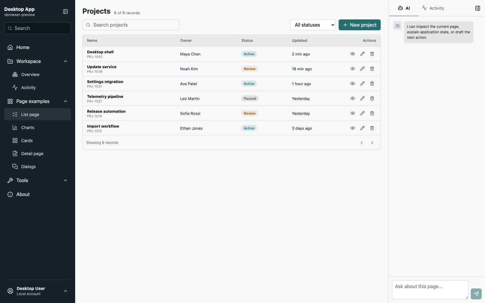
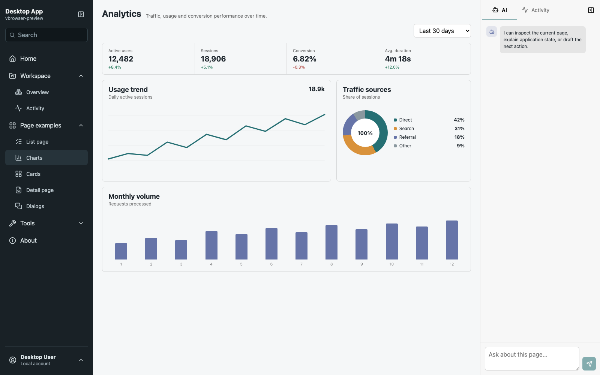
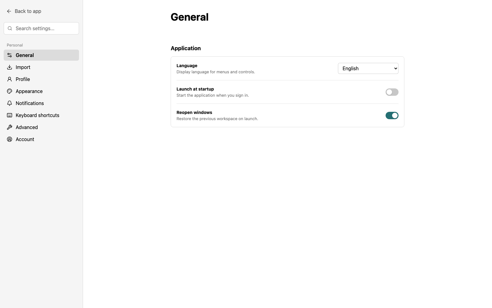

# Desktop App Scaffold

一套面向生产环境与二次开发的跨平台桌面应用脚手架，基于 Electron、Vue 3 和 TypeScript 构建。内置可折叠多级导航、独立滚动内容区、可扩展右侧工具栏、设置中心、CRUD 页面示例，以及安全的类型化 IPC 边界。



<p align="center">
  
  
</p>

## 核心能力

- **桌面应用骨架**：主进程、preload、renderer 和 shared 分层清晰，适合持续扩展。
- **成熟导航结构**：支持多级菜单、全局搜索、左右侧栏独立展开收起与独立滚动。
- **页面示例齐全**：包含列表 CRUD、图表、卡片、详情、对话框和设置页面。
- **可扩展右栏**：通过注册表增加 AI、Activity 或其他业务工具，不需要修改面板核心逻辑。
- **安全 IPC**：renderer 不接触 Node.js、Electron 或文件系统，只使用类型化 `window.desktopAPI`。
- **生产工程能力**：内置配置持久化、日志、自动更新、单实例、窗口状态恢复和跨平台打包。
- **质量保障**：TypeScript strict、ESLint、Prettier、Vitest 和 GitHub Actions 已配置完成。

## 技术栈

| 层级           | 技术                                           |
| -------------- | ---------------------------------------------- |
| Desktop        | Electron 43、electron-vite、electron-builder   |
| Frontend       | Vue 3、Vue Router、Pinia、Lucide Icons         |
| Language       | TypeScript 5 strict mode、Zod                  |
| Infrastructure | electron-store、electron-log、electron-updater |
| Quality        | ESLint、Prettier、Vitest                       |

## 快速开始

环境要求：Node.js 22、Corepack、pnpm 11。

```bash
pnpm install
pnpm dev
```

开发模式会启动 Electron 窗口和 Vue 热更新服务。常用质量检查：

```bash
pnpm lint
pnpm typecheck
pnpm test
pnpm build
pnpm package
```

## 项目结构

```text
src/
├── main/                    Electron 主进程、窗口、IPC、日志、更新
├── preload/                 contextBridge 与 window.desktopAPI
├── renderer/
│   ├── components/          公共组件、侧边栏、右侧工具栏
│   ├── config/              菜单等可扩展注册表
│   ├── router/              页面路由
│   ├── services/            renderer 服务与浏览器预览降级
│   ├── stores/              Pinia 状态
│   ├── views/               页面与业务示例
│   └── styles/              全局布局与组件样式
└── shared/                  IPC 通道、Schema、共享类型与纯函数
tests/                       Vitest 测试
docs/images/                 README 页面截图
```

## 二次开发入口

### 新增页面

1. 在 `src/renderer/views` 创建页面，使用 `PageHeader.vue` 统一标题与工具栏。
2. 在 `src/renderer/router/index.ts` 注册路由。
3. 在 `src/renderer/config/navigation.ts` 注册菜单项。

`PageHeader` 的 `search` 插槽位于工具栏左侧，`actions` 插槽中的筛选器与命令位于右侧。

### 新增右栏工具

在 `src/renderer/components/right-panel` 创建工具组件，然后向 `tools.ts` 添加包含 `id`、`label`、图标和组件的注册项。

### 新增桌面能力

按以下方向扩展，不要在 renderer 中直接使用 Electron 或 Node.js：

```text
Vue view/store
  -> renderer desktop-api adapter
  -> preload bridge
  -> typed IPC channel
  -> validated main handler
  -> Electron / Node.js API
```

需要同步更新：

1. `src/shared/ipc.ts` 中的通道和调用类型。
2. `src/shared/types.ts` 中的 `DesktopAPI`。
3. `src/main/ipc` 中经过验证的 handler。
4. `src/preload/index.ts` 中的窄接口。
5. `src/renderer/services/desktop-api.ts` 中的适配与预览降级。
6. 对应的测试。

## 安全模型

应用窗口保持以下安全设置：

```ts
nodeIntegration: false
contextIsolation: true
sandbox: true
webSecurity: true
```

沙箱 preload 构建为 CommonJS `index.cjs`，并将 `electron` 保持为外部运行时模块。外部导航默认拒绝，只允许受控的 `https:` 和 `mailto:` 地址通过系统浏览器打开。

## 打包发布

```bash
# 当前平台目录包
pnpm package

# 发布构建
pnpm release
```

正式发布前，请在 `electron-builder.yml` 中替换 `appId`、`productName`、发布仓库和图标，并配置 Windows 签名或 macOS Developer ID 与 notarization 凭据。

## License

MIT
